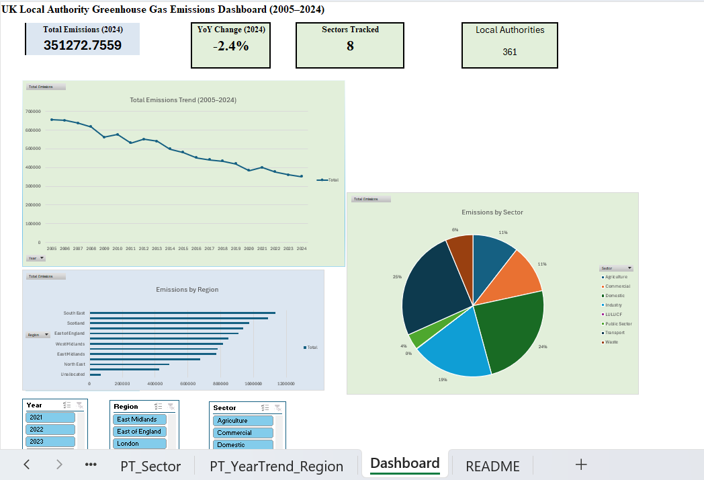

# UK Local Authority Greenhouse Gas Emissions Dashboard

## Purpose
Interactive Excel dashboard analysing UK greenhouse gas emissions by local authority, region, sector, and year (2005–2024), built as a companion piece to my MSc thesis project (Carbon Policy Insights, an XAI decision support system built in Python/Flask/React). Where that project used ML models globally across 142 countries, this one drills into UK-specific data using advanced Excel: Power Query, Power Pivot, DAX, and interactive dashboarding.

## Data source
UK Department for Energy Security and Net Zero (DESNZ), "UK local authority and regional greenhouse gas emissions statistics, 2005–2024," published June 2026. Publicly available under Open Government Licence v3.0.
[gov.uk/government/statistics/uk-local-authority-and-regional-greenhouse-gas-emissions-statistics-2005-to-2024](https://www.gov.uk/government/statistics/uk-local-authority-and-regional-greenhouse-gas-emissions-statistics-2005-to-2024)

## Methodology

- Raw CSV (586,765 rows) cleaned and transformed via Power Query
- Loaded into Excel's Data Model; 4 DAX measures built (Total Emissions, Prior Year Emissions, % Change YoY, Emissions per Capita)
- 3 interactive PivotCharts (year trend, region, sector), cross-slicer filtering via Year/Region/Sector slicers
- All figures cross-validated against DESNZ's own published statistical release

## Note on LULUCF
The Land Use, Land-Use Change & Forestry sector shows near-0% share in sector breakdowns. This is expected, not an error; LULUCF acts as a net carbon sink in many local authorities, so its cumulative effect nets close to zero relative to other sectors.

## Skills demonstrated
Power Query (ETL), Power Pivot/DAX, PivotTables & PivotCharts, slicer-based interactivity, data validation against external published sources.
